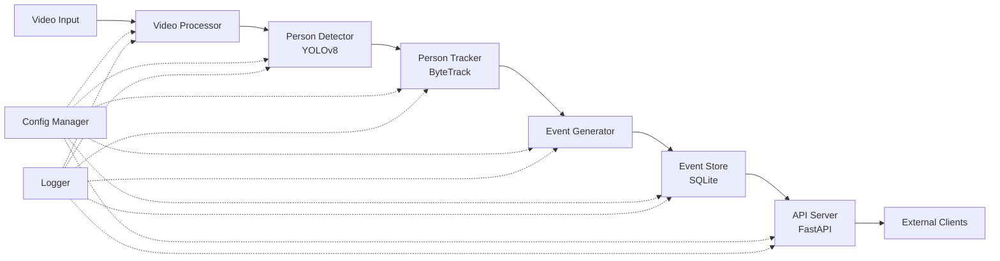
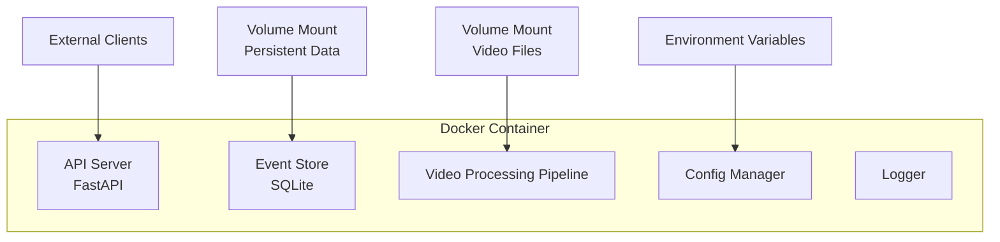

# Technical Design Document

## Overview

The Store Intelligence Platform is a computer vision-based analytics system that processes CCTV footage to extract actionable insights about customer behavior in retail environments. The system employs a pipeline architecture consisting of video processing, person detection (YOLOv8), person tracking (ByteTrack), event generation, persistent storage (SQLite), and a REST API layer (FastAPI) for data access and analytics.

### System Goals

- **Real-time and Batch Processing**: Support both live video streams and recorded footage analysis
- **Accurate Tracking**: Maintain consistent person identities across video frames to enable behavior analysis
- **Structured Event Generation**: Transform raw tracking data into meaningful business events (entry, exit, zone interactions, billing queue activities, reentry)
- **Persistent Storage**: Store events in a queryable database with idempotency guarantees
- **Analytics API**: Provide REST endpoints for metrics, conversion funnels, heatmaps, and anomaly detection
- **Production-Grade Quality**: Ensure reliability, maintainability, testability, and operational excellence

### Key Design Principles

1. **Separation of Concerns**: Each component has a single, well-defined responsibility
2. **Idempotency**: Duplicate event submissions produce identical results without side effects
3. **Fault Tolerance**: Component failures are isolated and don't cascade through the system
4. **Configurability**: System behavior is controlled via environment variables without code changes
5. **Observability**: Structured logging and health checks enable monitoring and troubleshooting
6. **Testability**: Dependency injection and clear interfaces enable comprehensive testing

## Architecture

### High-Level Architecture

The system follows a pipeline architecture with the following stages:




### Component Responsibilities

#### Video Processor
- Reads and decodes video files (MP4, AVI, MOV)
- Extracts frame metadata (timestamp, frame number, resolution)
- Maintains frame ordering
- Handles decode errors gracefully

#### Person Detector
- Detects people in video frames using YOLOv8
- Returns bounding boxes (x, y, width, height) and confidence scores
- Filters detections below 0.5 confidence threshold
- Processes at minimum 10 FPS on CPU

#### Person Tracker
- Assigns consistent Track_IDs across frames using ByteTrack
- Maintains trajectory history (positions over time)
- Handles temporary occlusions (up to 30 frames)
- Assigns new Track_IDs after extended absences

#### Event Generator
- Transforms tracking data into structured events
- Generates event types: ENTRY, EXIT, ZONE_ENTER, ZONE_EXIT, ZONE_DWELL, BILLING_QUEUE_JOIN, BILLING_QUEUE_ABANDON, REENTRY
- Assigns unique event_ids
- Validates events against JSON schema
- Calculates derived metrics (dwell time, queue wait time, time since last exit)

#### Event Store
- Persists events to SQLite database
- Enforces idempotency via unique event_id constraint
- Provides indexes on store_id, track_id, event_type, timestamp
- Supports concurrent reads
- Stores event metadata as JSON

#### API Server
- Exposes REST endpoints for event ingestion and analytics
- Implements endpoints: /events/ingest, /stores/{id}/metrics, /stores/{id}/funnel, /stores/{id}/heatmap, /stores/{id}/anomalies, /health
- Validates request payloads
- Handles errors with appropriate HTTP status codes
- Implements retry logic with exponential backoff for database operations

#### Config Manager
- Loads configuration from environment variables
- Provides default values
- Validates configuration on startup
- Exposes configuration to all components

#### Logger
- Provides structured JSON logging
- Includes timestamp, component name, correlation_id, log level
- Logs API requests with method, path, status_code, response_time
- Supports configurable log levels

### Data Flow

1. **Video Ingestion**: Video Processor reads video file and yields frames
2. **Detection**: Person Detector processes each frame and returns bounding boxes
3. **Tracking**: Person Tracker associates detections across frames and assigns Track_IDs
4. **Event Generation**: Event Generator analyzes tracking data and produces events
5. **Storage**: Event Store persists events to SQLite with idempotency checks
6. **API Access**: API Server queries Event Store and returns analytics

### Deployment Architecture



## Components and Interfaces

### Video Processor

**Interface:**
```python
class VideoProcessor:
    def __init__(self, video_path: str, logger: Logger):
        """Initialize video processor with file path."""
        
    def read_frames(self) -> Iterator[Frame]:
        """Yield frames from video with metadata."""
        
    def get_metadata(self) -> VideoMetadata:
        """Return video metadata (duration, fps, resolution)."""
```

**Frame Data Structure:**
```python
@dataclass
class Frame:
    frame_number: int
    timestamp: float  # seconds from video start
    image: np.ndarray  # HxWx3 BGR format
    resolution: Tuple[int, int]  # (width, height)
```

**Error Handling:**
- Logs decode errors and continues with next frame
- Raises exception if video file cannot be opened
- Validates supported formats (MP4, AVI, MOV)

### Person Detector

**Interface:**
```python
class PersonDetector:
    def __init__(self, model_path: str, confidence_threshold: float, logger: Logger):
        """Initialize YOLOv8 detector."""
        
    def detect(self, frame: np.ndarray) -> List[Detection]:
        """Detect people in frame and return bounding boxes."""
```

**Detection Data Structure:**
```python
@dataclass
class Detection:
    bbox: BoundingBox  # (x, y, width, height)
    confidence: float
    class_id: int  # person class = 0
```

**Configuration:**
- Model path: configurable via environment variable
- Confidence threshold: default 0.5, configurable
- Device: auto-detect GPU or fallback to CPU

### Person Tracker

**Interface:**
```python
class PersonTracker:
    def __init__(self, max_age: int, logger: Logger):
        """Initialize ByteTrack tracker."""
        
    def update(self, detections: List[Detection], frame_number: int) -> List[Track]:
        """Update tracks with new detections."""
        
    def get_trajectory(self, track_id: int) -> List[Position]:
        """Return position history for track."""
```

**Track Data Structure:**
```python
@dataclass
class Track:
    track_id: int
    bbox: BoundingBox
    frame_number: int
    age: int  # frames since last detection
    state: TrackState  # ACTIVE, LOST, REMOVED
```

**Configuration:**
- Max age: 30 frames (configurable)
- Trajectory history: stored in memory for active tracks

### Event Generator

**Interface:**
```python
class EventGenerator:
    def __init__(self, store_id: str, zones: List[Zone], logger: Logger):
        """Initialize event generator with store configuration."""
        
    def process_tracks(self, tracks: List[Track], frame_number: int) -> List[Event]:
        """Generate events from current tracks."""
        
    def finalize(self) -> List[Event]:
        """Generate final EXIT events for remaining tracks."""
```

**Event Data Structure:**
```python
@dataclass
class Event:
    event_id: str  # UUID
    event_type: EventType
    timestamp: datetime  # ISO 8601
    store_id: str
    track_id: int
    metadata: Dict[str, Any]  # event-specific fields
```

**Event Types:**
- ENTRY: track_id first appears
- EXIT: track_id absent for >30 frames
- ZONE_ENTER: track_id enters zone
- ZONE_EXIT: track_id exits zone
- ZONE_DWELL: track_id in zone >5 seconds
- BILLING_QUEUE_JOIN: track_id enters billing queue
- BILLING_QUEUE_ABANDON: track_id leaves queue without checkout
- REENTRY: track_id reappears after previous exit

**Zone Configuration:**
```python
@dataclass
class Zone:
    zone_id: str
    zone_name: str
    polygon: List[Point]  # boundary coordinates
    zone_type: ZoneType  # GENERAL, BILLING_QUEUE
```

**Event Generation Logic:**

1. **Entry/Exit Detection:**
   - Track first appearance → ENTRY event
   - Track absent >30 frames → EXIT event
   - Maintain track state map (track_id → last_seen_frame)

2. **Zone Interaction Detection:**
   - Check if track centroid is inside zone polygon (point-in-polygon test)
   - Track enters zone → ZONE_ENTER event
   - Track exits zone → ZONE_EXIT event
   - Track in zone >5 seconds → ZONE_DWELL event with duration
   - Maintain zone state map (track_id → {zone_id, enter_frame})

3. **Billing Queue Detection:**
   - Special zone type: BILLING_QUEUE
   - Track enters → BILLING_QUEUE_JOIN event with queue_position
   - Track exits without checkout flag → BILLING_QUEUE_ABANDON event
   - Calculate queue_wait_time_seconds
   - Flag high_wait_time if >300 seconds

4. **Reentry Detection:**
   - Maintain exit history (track_id → exit_timestamp)
   - New track appearance → check if similar to recent exit (within 300s)
   - If match found → REENTRY event with time_since_last_exit_seconds
   - Classification: immediate_return if <300 seconds

**Schema Validation:**
- All events validated against JSON schema before emission
- Invalid events logged and discarded
- Required fields: event_id, event_type, timestamp, store_id, track_id

### Event Store

**Interface:**
```python
class EventStore:
    def __init__(self, db_path: str, logger: Logger):
        """Initialize SQLite connection and schema."""
        
    def insert_event(self, event: Event) -> bool:
        """Insert event, return False if duplicate event_id."""
        
    def insert_events_batch(self, events: List[Event]) -> BatchResult:
        """Insert events atomically."""
        
    def query_events(self, filters: EventFilters) -> List[Event]:
        """Query events with filters."""
        
    def get_store_metrics(self, store_id: str, start_time: datetime, end_time: datetime) -> StoreMetrics:
        """Calculate aggregated metrics."""
        
    def get_conversion_funnel(self, store_id: str, zone_id: Optional[str]) -> ConversionFunnel:
        """Calculate funnel stages and conversion rates."""
        
    def get_heatmap(self, store_id: str, resolution: int) -> Heatmap:
        """Generate grid-based heatmap from trajectories."""
        
    def detect_anomalies(self, store_id: str, time_window: timedelta) -> List[Anomaly]:
        """Detect statistical anomalies."""
        
    def health_check(self) -> bool:
        """Check database connectivity."""
```

**Database Schema:**

```sql
CREATE TABLE events (
    event_id TEXT PRIMARY KEY,
    event_type TEXT NOT NULL,
    timestamp TEXT NOT NULL,
    store_id TEXT NOT NULL,
    track_id INTEGER NOT NULL,
    metadata TEXT NOT NULL,
    created_at TEXT DEFAULT CURRENT_TIMESTAMP
);

CREATE INDEX idx_store_id ON events(store_id);
CREATE INDEX idx_track_id ON events(track_id);
CREATE INDEX idx_event_type ON events(event_type);
CREATE INDEX idx_timestamp ON events(timestamp);
CREATE INDEX idx_store_timestamp ON events(store_id, timestamp);
```

**Idempotency Implementation:**
- event_id is PRIMARY KEY (unique constraint)
- INSERT OR IGNORE for idempotent inserts
- Return success for duplicate insertions

**Concurrency:**
- SQLite WAL mode for concurrent reads
- Write operations serialized via connection pool
- Retry logic with exponential backoff for lock contention

### API Server

**Framework:** FastAPI

**Endpoints:**

#### POST /events/ingest
```python
@app.post("/events/ingest", status_code=201)
async def ingest_events(events: Union[Event, List[Event]]) -> IngestResponse:
    """Ingest single event or batch."""
```

**Request Body:**
```json
{
  "event_id": "uuid",
  "event_type": "ENTRY",
  "timestamp": "2024-01-15T10:30:00Z",
  "store_id": "store_001",
  "track_id": 42,
  "metadata": {}
}
```

**Response:**
- 201: Event(s) created
- 200: Duplicate event_id (idempotent)
- 400: Validation error
- 500: Server error

#### GET /stores/{id}/metrics
```python
@app.get("/stores/{id}/metrics")
async def get_store_metrics(
    id: str,
    start_time: Optional[datetime] = None,
    end_time: Optional[datetime] = None
) -> StoreMetrics:
    """Get aggregated store metrics."""
```

**Response:**
```json
{
  "store_id": "store_001",
  "total_entries": 1250,
  "total_exits": 1200,
  "current_occupancy": 50,
  "average_visit_duration_seconds": 1800.5,
  "time_range": {
    "start": "2024-01-15T00:00:00Z",
    "end": "2024-01-15T23:59:59Z"
  }
}
```

**Response Codes:**
- 200: Success
- 404: Store not found
- 500: Server error

#### GET /stores/{id}/funnel
```python
@app.get("/stores/{id}/funnel")
async def get_conversion_funnel(
    id: str,
    zone_id: Optional[str] = None
) -> ConversionFunnel:
    """Get customer journey funnel."""
```

**Response:**
```json
{
  "store_id": "store_001",
  "stages": [
    {
      "stage": "entries",
      "count": 1000,
      "conversion_rate": 1.0
    },
    {
      "stage": "zone_visits",
      "count": 800,
      "conversion_rate": 0.8
    },
    {
      "stage": "billing_queue_joins",
      "count": 600,
      "conversion_rate": 0.75
    },
    {
      "stage": "completed_purchases",
      "count": 550,
      "conversion_rate": 0.917
    }
  ]
}
```

#### GET /stores/{id}/heatmap
```python
@app.get("/stores/{id}/heatmap")
async def get_heatmap(
    id: str,
    resolution: int = 50
) -> Heatmap:
    """Get spatial density heatmap."""
```

**Response:**
```json
{
  "store_id": "store_001",
  "resolution": 50,
  "grid": {
    "width": 20,
    "height": 15
  },
  "density": [[0.1, 0.3, ...], [...], ...]
}
```

**Heatmap Calculation:**
1. Query all trajectory positions for store
2. Create grid with specified resolution (cell size in pixels)
3. Count positions in each cell
4. Normalize to [0, 1] range

#### GET /stores/{id}/anomalies
```python
@app.get("/stores/{id}/anomalies")
async def detect_anomalies(
    id: str,
    time_window: timedelta = timedelta(hours=24)
) -> List[Anomaly]:
    """Detect unusual patterns."""
```

**Response:**
```json
{
  "store_id": "store_001",
  "anomalies": [
    {
      "type": "sudden_crowd_surge",
      "severity": "high",
      "timestamp": "2024-01-15T14:30:00Z",
      "description": "Occupancy increased by 150% in 10 minutes",
      "metrics": {
        "baseline": 50,
        "observed": 125,
        "threshold": 100
      }
    }
  ]
}
```

**Anomaly Detection Logic:**

1. **Sudden Crowd Surge:**
   - Calculate rolling average occupancy (1-hour window)
   - Detect when current occupancy > mean + 2*std_dev
   - Severity: high if >3*std_dev, medium if >2*std_dev

2. **High Queue Abandonment:**
   - Calculate abandonment rate: abandons / (joins + abandons)
   - Detect when rate > mean + 2*std_dev
   - Severity: high if rate >0.5, medium if rate >0.3

3. **Unusual Dwell Time:**
   - Calculate average dwell time per zone
   - Detect when dwell time > mean + 2*std_dev or < mean - 2*std_dev
   - Severity: medium

4. **Off-Hours Activity:**
   - Define normal hours (e.g., 9 AM - 9 PM)
   - Detect entries outside normal hours
   - Severity: low if <10 entries, medium if >10

#### GET /health
```python
@app.get("/health")
async def health_check() -> HealthStatus:
    """System health check."""
```

**Response:**
```json
{
  "status": "healthy",
  "checks": {
    "database": "ok",
    "response_time_ms": 45
  },
  "timestamp": "2024-01-15T10:30:00Z"
}
```

**Health Status:**
- healthy: All checks pass
- degraded: Some checks fail but system operational
- unhealthy: Critical checks fail

**Response Codes:**
- 200: Healthy or degraded
- 503: Unhealthy

### Configuration Manager

**Interface:**
```python
class ConfigManager:
    def __init__(self):
        """Load and validate configuration."""
        
    def get(self, key: str, default: Any = None) -> Any:
        """Get configuration value."""
        
    def validate(self) -> None:
        """Validate all required configuration."""
```

**Configuration Parameters:**

| Parameter | Environment Variable | Default | Description |
|-----------|---------------------|---------|-------------|
| Database Path | `DB_PATH` | `./data/events.db` | SQLite database file |
| API Host | `API_HOST` | `0.0.0.0` | API server bind address |
| API Port | `API_PORT` | `8000` | API server port |
| Log Level | `LOG_LEVEL` | `INFO` | Logging level |
| YOLOv8 Model Path | `YOLO_MODEL_PATH` | `./models/yolov8n.pt` | Person detection model |
| Confidence Threshold | `CONFIDENCE_THRESHOLD` | `0.5` | Detection confidence |
| Tracker Max Age | `TRACKER_MAX_AGE` | `30` | Frames before track removal |
| Zone Config Path | `ZONE_CONFIG_PATH` | `./config/zones.json` | Zone definitions |

**Validation:**
- Check required files exist (model paths, zone config)
- Validate numeric ranges (confidence 0-1, port 1-65535)
- Exit with non-zero status if validation fails

### Logger

**Interface:**
```python
class Logger:
    def __init__(self, component: str, level: str):
        """Initialize logger for component."""
        
    def debug(self, message: str, **kwargs):
    def info(self, message: str, **kwargs):
    def warning(self, message: str, **kwargs):
    def error(self, message: str, **kwargs):
    def critical(self, message: str, **kwargs):
```

**Log Format:**
```json
{
  "timestamp": "2024-01-15T10:30:00.123Z",
  "level": "INFO",
  "component": "PersonDetector",
  "correlation_id": "req-123",
  "message": "Detected 5 people in frame 42",
  "context": {
    "frame_number": 42,
    "detection_count": 5,
    "processing_time_ms": 45
  }
}
```

**Correlation ID:**
- Generated for each video processing job or API request
- Propagated through all components
- Enables tracing operations across components

## Data Models

### Event Schema

**Base Event:**
```json
{
  "event_id": "string (UUID)",
  "event_type": "string (enum)",
  "timestamp": "string (ISO 8601)",
  "store_id": "string",
  "track_id": "integer",
  "metadata": "object"
}
```

**Event Type Schemas:**

**ENTRY:**
```json
{
  "event_type": "ENTRY",
  "metadata": {
    "entry_point": "string (optional)"
  }
}
```

**EXIT:**
```json
{
  "event_type": "EXIT",
  "metadata": {
    "exit_point": "string (optional)",
    "visit_duration_seconds": "number"
  }
}
```

**ZONE_ENTER:**
```json
{
  "event_type": "ZONE_ENTER",
  "metadata": {
    "zone_id": "string",
    "zone_name": "string"
  }
}
```

**ZONE_EXIT:**
```json
{
  "event_type": "ZONE_EXIT",
  "metadata": {
    "zone_id": "string",
    "zone_name": "string",
    "zone_duration_seconds": "number"
  }
}
```

**ZONE_DWELL:**
```json
{
  "event_type": "ZONE_DWELL",
  "metadata": {
    "zone_id": "string",
    "zone_name": "string",
    "dwell_duration_seconds": "number"
  }
}
```

**BILLING_QUEUE_JOIN:**
```json
{
  "event_type": "BILLING_QUEUE_JOIN",
  "metadata": {
    "queue_position": "integer"
  }
}
```

**BILLING_QUEUE_ABANDON:**
```json
{
  "event_type": "BILLING_QUEUE_ABANDON",
  "metadata": {
    "queue_wait_time_seconds": "number",
    "high_wait_time": "boolean"
  }
}
```

**REENTRY:**
```json
{
  "event_type": "REENTRY",
  "metadata": {
    "time_since_last_exit_seconds": "number",
    "immediate_return": "boolean",
    "previous_track_id": "integer"
  }
}
```

### Zone Configuration Schema

```json
{
  "zones": [
    {
      "zone_id": "string",
      "zone_name": "string",
      "zone_type": "GENERAL | BILLING_QUEUE",
      "polygon": [
        {"x": "number", "y": "number"},
        ...
      ]
    }
  ]
}
```

### API Request/Response Models

**IngestResponse:**
```json
{
  "success": "boolean",
  "events_processed": "integer",
  "errors": ["string"]
}
```

**StoreMetrics:**
```json
{
  "store_id": "string",
  "total_entries": "integer",
  "total_exits": "integer",
  "current_occupancy": "integer",
  "average_visit_duration_seconds": "number",
  "time_range": {
    "start": "string (ISO 8601)",
    "end": "string (ISO 8601)"
  }
}
```

**ConversionFunnel:**
```json
{
  "store_id": "string",
  "stages": [
    {
      "stage": "string",
      "count": "integer",
      "conversion_rate": "number"
    }
  ]
}
```

**Heatmap:**
```json
{
  "store_id": "string",
  "resolution": "integer",
  "grid": {
    "width": "integer",
    "height": "integer"
  },
  "density": "array[array[number]]"
}
```

**Anomaly:**
```json
{
  "type": "string",
  "severity": "low | medium | high",
  "timestamp": "string (ISO 8601)",
  "description": "string",
  "metrics": "object"
}
```

**HealthStatus:**
```json
{
  "status": "healthy | degraded | unhealthy",
  "checks": "object",
  "timestamp": "string (ISO 8601)"
}
```

## Correctness Properties

*A property is a characteristic or behavior that should hold true across all valid executions of a system—essentially, a formal statement about what the system should do. Properties serve as the bridge between human-readable specifications and machine-verifiable correctness guarantees.*

### Property Reflection

After analyzing all 120 acceptance criteria, several properties were identified as redundant or combinable:

- **Event field validation properties** (4.3, 8.2, 8.3) → Combined into Property 1 (comprehensive event schema validation)
- **Event pairing invariants** (4.5, 5.6) → Combined into Property 2 (universal pairing invariant)
- **Idempotency properties** (9.3, 10.4, 16.1, 16.2, 16.5) → Combined into Property 3 (system-wide idempotency)
- **Logging structure properties** (17.1, 17.2, 17.3) → Combined into Property 15 (comprehensive log validation)
- **Metadata field properties** (5.4, 6.5, 7.4) → Covered by Property 1 (event schema validation)

The following properties represent the minimal set of unique, non-redundant correctness guarantees:

### Property 1: Event Schema Completeness

*For any* generated event, the event SHALL contain all required base fields (event_id, event_type, timestamp, store_id, track_id) and all event-type-specific metadata fields as defined in the schema.

**Validates: Requirements 4.3, 8.1, 8.2, 8.3, 5.4**

### Property 2: Event Pairing Invariant

*For any* complete video processing run, every ENTRY event SHALL have a corresponding EXIT event (or the track is still active), and every ZONE_ENTER event SHALL have a corresponding ZONE_EXIT event (or the track is still in the zone).

**Validates: Requirements 4.5, 5.6**

### Property 3: System-Wide Idempotency

*For any* event with a given event_id, submitting the event multiple times SHALL result in exactly one stored record and identical responses for all submissions.

**Validates: Requirements 9.3, 10.4, 16.1, 16.2, 16.5**

### Property 4: Frame Ordering Preservation

*For any* processed video, the frame_number values SHALL increase monotonically, preserving the original frame sequence.

**Validates: Requirements 1.5**

### Property 5: Frame Metadata Completeness

*For any* successfully decoded video frame, the frame SHALL include all metadata fields (frame_number, timestamp, resolution) with valid values.

**Validates: Requirements 1.4**

### Property 6: Detection Confidence Filtering

*For any* detection result from YOLOv8, detections with confidence scores below the configured threshold SHALL be excluded from the output.

**Validates: Requirements 2.4**

### Property 7: Detection Structure Validity

*For any* detection returned by the Person_Detector, the detection SHALL include a complete bounding box (x, y, width, height) and a confidence score in the range [0, 1].

**Validates: Requirements 2.2, 2.3**

### Property 8: Trajectory History Maintenance

*For any* active track, the Person_Tracker SHALL maintain a retrievable trajectory history containing all positions over time.

**Validates: Requirements 3.5**

### Property 9: Entry Event Generation

*For any* track_id appearing for the first time in the video, the Event_Generator SHALL create an ENTRY event with that track_id.

**Validates: Requirements 4.1**

### Property 10: Exit Event Generation

*For any* track_id that is absent for more than the configured max_age frames, the Event_Generator SHALL create an EXIT event.

**Validates: Requirements 4.2**

### Property 11: Event ID Uniqueness

*For any* set of events generated during a processing run, all event_id values SHALL be unique.

**Validates: Requirements 4.4**

### Property 12: Zone Boundary Detection

*For any* track crossing a zone boundary (entering or exiting), the Event_Generator SHALL create the appropriate ZONE_ENTER or ZONE_EXIT event.

**Validates: Requirements 5.1, 5.2**

### Property 13: Zone Dwell Event Generation

*For any* track remaining in a zone for more than the configured dwell threshold (5 seconds), the Event_Generator SHALL create a ZONE_DWELL event with accurate dwell_duration_seconds.

**Validates: Requirements 5.3, 5.5**

### Property 14: Billing Queue Event Generation

*For any* track entering a BILLING_QUEUE zone, the Event_Generator SHALL create a BILLING_QUEUE_JOIN event with queue_position, and if the track exits without checkout, SHALL create a BILLING_QUEUE_ABANDON event with queue_wait_time_seconds.

**Validates: Requirements 6.1, 6.2, 6.3, 6.5**

### Property 15: High Wait Time Flagging

*For any* billing queue event where queue_wait_time_seconds exceeds 300, the event SHALL have high_wait_time flag set to true.

**Validates: Requirements 6.4**

### Property 16: Reentry Detection and Classification

*For any* track_id that reappears after a previous EXIT event, the Event_Generator SHALL create a REENTRY event with time_since_last_exit_seconds, previous_track_id, and immediate_return flag (true if time < 300 seconds).

**Validates: Requirements 7.1, 7.2, 7.3, 7.4**

### Property 17: ISO 8601 Timestamp Format

*For any* event, all timestamp fields SHALL conform to ISO 8601 format.

**Validates: Requirements 8.5**

### Property 18: API Event Ingestion Success

*For any* valid event JSON posted to /events/ingest, the API SHALL store the event and return HTTP 201 (or 200 if duplicate event_id).

**Validates: Requirements 10.2, 10.4**

### Property 19: API Validation Error Response

*For any* invalid event JSON posted to /events/ingest, the API SHALL return HTTP 400 with descriptive validation errors.

**Validates: Requirements 10.3, 18.3**

### Property 20: Batch Ingestion Atomicity

*For any* batch of events posted to /events/ingest, either all events SHALL be stored successfully, or none SHALL be stored (atomic transaction).

**Validates: Requirements 10.6**

### Property 21: Store Metrics Completeness

*For any* store with at least one event, the /stores/{id}/metrics endpoint SHALL return all required fields (total_entries, total_exits, current_occupancy, average_visit_duration_seconds).

**Validates: Requirements 11.2**

### Property 22: Store Metrics Time Filtering

*For any* time range specified via start_time and end_time parameters, the metrics SHALL include only events within that range.

**Validates: Requirements 11.3**

### Property 23: Store Metrics Calculation Accuracy

*For any* set of events for a store, the calculated metrics SHALL accurately reflect the event data (e.g., total_entries = count of ENTRY events, current_occupancy = entries - exits).

**Validates: Requirements 11.5**

### Property 24: Conversion Funnel Completeness

*For any* store with events, the /stores/{id}/funnel endpoint SHALL return all funnel stages (entries, zone_visits, billing_queue_joins, completed_purchases) with accurate counts.

**Validates: Requirements 12.2**

### Property 25: Conversion Rate Calculation

*For any* conversion funnel, the conversion_rate for each stage SHALL equal the ratio of that stage's count to the previous stage's count.

**Validates: Requirements 12.3**

### Property 26: Funnel Zone Filtering

*For any* zone_id parameter provided to /stores/{id}/funnel, the funnel SHALL include only events related to that zone.

**Validates: Requirements 12.4**

### Property 27: Heatmap Grid Structure

*For any* heatmap request with resolution parameter, the returned heatmap SHALL have a grid structure with dimensions calculated from the store's spatial bounds and the specified resolution.

**Validates: Requirements 13.2, 13.3**

### Property 28: Heatmap Density Calculation

*For any* store with trajectory data, the heatmap density values SHALL accurately reflect the count of trajectory positions in each grid cell.

**Validates: Requirements 13.4**

### Property 29: Heatmap Density Normalization

*For any* heatmap, all density values SHALL be in the range [0, 1], with 1 representing the maximum density cell.

**Validates: Requirements 13.5**

### Property 30: Anomaly Detection Completeness

*For any* event pattern matching anomaly criteria (sudden_crowd_surge, high_queue_abandonment, unusual_dwell_time, off_hours_activity), the /stores/{id}/anomalies endpoint SHALL detect and return the anomaly with type, severity, timestamp, and description.

**Validates: Requirements 14.2, 14.3**

### Property 31: Anomaly Statistical Threshold

*For any* metric value exceeding the statistical threshold (mean + 2*std_dev), the system SHALL classify it as an anomaly.

**Validates: Requirements 14.4**

### Property 32: Anomaly Time Window Filtering

*For any* time_window parameter provided to /stores/{id}/anomalies, the anomaly detection SHALL consider only events within that time window.

**Validates: Requirements 14.5**

### Property 33: Structured Logging Format

*For any* log entry, the log SHALL be valid JSON containing timestamp, level (DEBUG/INFO/WARNING/ERROR/CRITICAL), component name, and correlation_id.

**Validates: Requirements 17.1, 17.2, 17.3**

### Property 34: API Request Logging

*For any* API request, the system SHALL log the request with method, path, status_code, and response_time.

**Validates: Requirements 17.4**

### Property 35: Error Response Sanitization

*For any* error occurring during API request processing, the API response SHALL NOT contain internal error details such as stack traces.

**Validates: Requirements 18.4**

## Error Handling

### Video Processing Errors

**Frame Decode Failures:**
- **Behavior**: Log error with frame number and continue processing next frame
- **Rationale**: Isolated frame corruption shouldn't halt entire video processing
- **Implementation**: Try-catch around frame decode, increment error counter, continue loop

**Video File Not Found:**
- **Behavior**: Raise FileNotFoundError immediately
- **Rationale**: Cannot proceed without input file
- **Implementation**: Check file existence before opening

**Unsupported Format:**
- **Behavior**: Raise ValueError with supported formats list
- **Rationale**: Early failure prevents wasted processing time
- **Implementation**: Validate file extension against whitelist

### Detection and Tracking Errors

**Model Loading Failures:**
- **Behavior**: Raise RuntimeError with model path
- **Rationale**: Cannot proceed without detection model
- **Implementation**: Validate model file exists and loads successfully at initialization

**Detection Failures:**
- **Behavior**: Log warning and return empty detection list for that frame
- **Rationale**: Temporary detection failures shouldn't halt processing
- **Implementation**: Try-catch around model inference

**Tracking State Corruption:**
- **Behavior**: Log error and reset tracker state
- **Rationale**: Recover from corrupted state rather than crash
- **Implementation**: Validate track state invariants, reset on violation

### Event Generation Errors

**Schema Validation Failures:**
- **Behavior**: Log validation error with event details and discard event
- **Rationale**: Invalid events shouldn't be stored
- **Implementation**: Validate against JSON schema before storage

**Zone Configuration Errors:**
- **Behavior**: Raise ValueError at initialization
- **Rationale**: Invalid zone definitions prevent correct event generation
- **Implementation**: Validate zone polygons are closed and non-self-intersecting

### Database Errors

**Connection Failures:**
- **Behavior**: Retry up to 3 times with exponential backoff (1s, 2s, 4s)
- **Rationale**: Temporary network issues shouldn't cause data loss
- **Implementation**: Retry decorator with exponential backoff

**Write Failures:**
- **Behavior**: Log error and raise exception to caller
- **Rationale**: Caller needs to know write failed
- **Implementation**: Propagate SQLite exceptions after retries exhausted

**Constraint Violations (Duplicate event_id):**
- **Behavior**: Return success (idempotent behavior)
- **Rationale**: Duplicate submissions should be transparent to caller
- **Implementation**: INSERT OR IGNORE, check affected rows

**Lock Contention:**
- **Behavior**: Retry with exponential backoff
- **Rationale**: Concurrent writes may cause temporary locks
- **Implementation**: Catch OperationalError, retry with backoff

### API Errors

**Request Validation Failures:**
- **Behavior**: Return HTTP 400 with structured error response
- **Response Format**:
  ```json
  {
    "error": "Validation Error",
    "details": [
      {"field": "event_type", "message": "Invalid event type"}
    ]
  }
  ```
- **Rationale**: Client needs specific feedback to fix request
- **Implementation**: Pydantic validation with custom error formatting

**Resource Not Found:**
- **Behavior**: Return HTTP 404 with error message
- **Response Format**:
  ```json
  {
    "error": "Not Found",
    "message": "Store with id 'store_001' not found"
  }
  ```
- **Rationale**: Distinguish between validation errors and missing resources
- **Implementation**: Check resource existence before processing

**Database Unavailable:**
- **Behavior**: Return HTTP 503 with retry-after header
- **Response Format**:
  ```json
  {
    "error": "Service Unavailable",
    "message": "Database temporarily unavailable"
  }
  ```
- **Rationale**: Client should retry later
- **Implementation**: Catch database connection errors, return 503

**Unhandled Exceptions:**
- **Behavior**: Log full stack trace and return HTTP 500 with generic message
- **Response Format**:
  ```json
  {
    "error": "Internal Server Error",
    "message": "An unexpected error occurred"
  }
  ```
- **Rationale**: Don't expose internal details to clients
- **Implementation**: Global exception handler in FastAPI

### Configuration Errors

**Missing Required Configuration:**
- **Behavior**: Log error and exit with status code 1
- **Rationale**: Cannot start with invalid configuration
- **Implementation**: Validate all required config at startup

**Invalid Configuration Values:**
- **Behavior**: Log specific validation error and exit with status code 1
- **Example**: "CONFIDENCE_THRESHOLD must be between 0 and 1, got 1.5"
- **Rationale**: Fail fast with clear error message
- **Implementation**: Validate ranges and types at startup

**Missing Required Files:**
- **Behavior**: Log error with file path and exit with status code 1
- **Example**: "Model file not found: ./models/yolov8n.pt"
- **Rationale**: Cannot proceed without required files
- **Implementation**: Check file existence during configuration validation

### Resource Cleanup

**Video File Handles:**
- **Behavior**: Close video capture in finally block
- **Implementation**: Context manager or explicit try-finally

**Database Connections:**
- **Behavior**: Close connections in finally block or use connection pooling
- **Implementation**: SQLite connection context manager

**Temporary Files:**
- **Behavior**: Delete temporary files in finally block
- **Implementation**: tempfile module with automatic cleanup

**Memory Management:**
- **Behavior**: Clear trajectory history for removed tracks
- **Implementation**: Periodic cleanup of old track data

## Testing Strategy

### Overview

The testing strategy employs a dual approach combining property-based testing for universal correctness guarantees with example-based unit tests for specific scenarios and integration tests for external dependencies.

### Property-Based Testing

**Framework**: Hypothesis (Python)

**Configuration**:
- Minimum 100 iterations per property test
- Deterministic random seed for reproducibility
- Shrinking enabled for minimal failing examples

**Test Organization**:
Each property test MUST include a comment tag referencing the design property:
```python
# Feature: store-intelligence-platform, Property 1: Event Schema Completeness
@given(event=event_strategy())
def test_event_schema_completeness(event):
    assert has_required_fields(event)
    assert has_type_specific_fields(event)
```

**Property Test Coverage**:

1. **Event Generation Properties** (Properties 1, 2, 9-16):
   - Generate random track sequences
   - Generate random zone configurations
   - Verify event generation logic

2. **Validation Properties** (Properties 1, 6, 7, 17):
   - Generate random valid and invalid inputs
   - Verify filtering and validation logic

3. **Idempotency Properties** (Property 3):
   - Generate random events
   - Submit multiple times
   - Verify single storage and identical responses

4. **Calculation Properties** (Properties 23, 25, 28, 29, 31):
   - Generate random event datasets
   - Verify metric calculations
   - Verify statistical computations

5. **API Properties** (Properties 18-22, 24, 26-27, 30, 32, 35):
   - Generate random API requests
   - Verify response structure and correctness

**Custom Generators**:

```python
# Event generator
@composite
def event_strategy(draw):
    event_type = draw(sampled_from(EventType))
    return Event(
        event_id=draw(uuids()),
        event_type=event_type,
        timestamp=draw(datetimes()),
        store_id=draw(text(min_size=1)),
        track_id=draw(integers(min_value=0)),
        metadata=draw(metadata_for_type(event_type))
    )

# Track sequence generator
@composite
def track_sequence_strategy(draw):
    num_frames = draw(integers(min_value=10, max_value=1000))
    num_tracks = draw(integers(min_value=1, max_value=20))
    # Generate realistic track appearances/disappearances
    ...

# Zone configuration generator
@composite
def zone_strategy(draw):
    num_vertices = draw(integers(min_value=3, max_value=10))
    # Generate valid polygon (non-self-intersecting)
    ...
```

### Unit Testing

**Framework**: pytest

**Coverage Target**: Minimum 70% code coverage

**Unit Test Focus**:

1. **Component Initialization**:
   - Test each component initializes correctly with valid config
   - Test initialization fails appropriately with invalid config

2. **Specific Edge Cases**:
   - Empty video files
   - Single-frame videos
   - Tracks at exact 30-frame boundary
   - Zero-area zones
   - Concurrent database writes

3. **Error Handling Scenarios**:
   - Frame decode failures
   - Model loading failures
   - Database connection failures
   - Invalid API requests

4. **Boundary Conditions**:
   - Confidence threshold exactly 0.5
   - Dwell time exactly 5 seconds
   - Queue wait time exactly 300 seconds
   - Track age exactly 30 frames

5. **Mock-Based Tests**:
   - Mock YOLOv8 model for detector tests
   - Mock ByteTrack for tracker tests
   - Mock database for API tests

**Example Unit Tests**:

```python
def test_video_processor_handles_decode_error(mock_video_capture):
    """Test that decode errors are logged and processing continues."""
    mock_video_capture.read.side_effect = [
        (True, frame1),
        (False, None),  # Decode error
        (True, frame2)
    ]
    processor = VideoProcessor("test.mp4", logger)
    frames = list(processor.read_frames())
    assert len(frames) == 2
    assert logger.error.called

def test_detector_filters_low_confidence():
    """Test that detections below threshold are excluded."""
    detector = PersonDetector(model_path, confidence_threshold=0.5, logger)
    detections = detector.detect(frame)
    assert all(d.confidence >= 0.5 for d in detections)

def test_event_store_idempotency():
    """Test that duplicate event_id insertions are idempotent."""
    store = EventStore(":memory:", logger)
    event = create_test_event()
    result1 = store.insert_event(event)
    result2 = store.insert_event(event)
    assert result1 == True
    assert result2 == True  # Idempotent
    assert store.query_events({}).count() == 1
```

### Integration Testing

**Framework**: pytest with real dependencies

**Integration Test Focus**:

1. **Video Processing Pipeline**:
   - End-to-end test with real video file
   - Verify events are generated and stored
   - Use small test video (10 seconds)

2. **API Endpoints**:
   - Test all endpoints with real database
   - Test request/response formats
   - Test error responses

3. **Database Operations**:
   - Test with real SQLite database
   - Test concurrent read operations
   - Test transaction atomicity

4. **Performance Benchmarks**:
   - Detector: >=10 FPS on CPU
   - Health endpoint: <100ms response time
   - Metrics endpoint: <500ms for 1M events
   - Event store: >=1000 events/second write throughput

**Example Integration Tests**:

```python
@pytest.mark.integration
def test_end_to_end_video_processing():
    """Test complete pipeline with real video."""
    video_path = "tests/data/test_video.mp4"
    config = load_test_config()
    
    # Process video
    processor = VideoProcessor(video_path, logger)
    detector = PersonDetector(config.model_path, config.threshold, logger)
    tracker = PersonTracker(config.max_age, logger)
    event_gen = EventGenerator(config.store_id, config.zones, logger)
    event_store = EventStore(config.db_path, logger)
    
    for frame in processor.read_frames():
        detections = detector.detect(frame.image)
        tracks = tracker.update(detections, frame.frame_number)
        events = event_gen.process_tracks(tracks, frame.frame_number)
        for event in events:
            event_store.insert_event(event)
    
    # Verify events were generated
    events = event_store.query_events({"store_id": config.store_id})
    assert len(events) > 0
    assert any(e.event_type == EventType.ENTRY for e in events)

@pytest.mark.integration
def test_api_metrics_endpoint(test_client, populated_database):
    """Test metrics endpoint with real database."""
    response = test_client.get("/stores/store_001/metrics")
    assert response.status_code == 200
    data = response.json()
    assert "total_entries" in data
    assert "total_exits" in data
    assert "current_occupancy" in data
    assert "average_visit_duration_seconds" in data

@pytest.mark.performance
def test_detector_performance():
    """Test detector meets 10 FPS requirement."""
    detector = PersonDetector(model_path, 0.5, logger)
    frame = load_test_frame()
    
    start = time.time()
    for _ in range(100):
        detector.detect(frame)
    elapsed = time.time() - start
    
    fps = 100 / elapsed
    assert fps >= 10, f"Detector only achieved {fps:.2f} FPS"
```

### Test Data Management

**Synthetic Data Generation**:
- Use Hypothesis for random test data
- Create fixtures for common test scenarios
- Generate realistic track sequences

**Test Video Files**:
- Small test videos (10-30 seconds)
- Various resolutions and formats
- Known person counts for validation

**Database Fixtures**:
- Pre-populated databases for API tests
- Various event distributions
- Edge cases (empty stores, single events)

### Continuous Integration

**CI Pipeline**:
1. Run linter (flake8, black)
2. Run type checker (mypy)
3. Run unit tests with coverage
4. Run property tests (100 iterations)
5. Run integration tests
6. Generate coverage report
7. Fail if coverage <70%

**Test Execution Time**:
- Unit tests: <30 seconds
- Property tests: <2 minutes
- Integration tests: <5 minutes
- Total CI time: <10 minutes

### Test Organization

```
tests/
├── unit/
│   ├── test_video_processor.py
│   ├── test_person_detector.py
│   ├── test_person_tracker.py
│   ├── test_event_generator.py
│   ├── test_event_store.py
│   └── test_api.py
├── property/
│   ├── test_event_properties.py
│   ├── test_validation_properties.py
│   ├── test_idempotency_properties.py
│   ├── test_calculation_properties.py
│   └── test_api_properties.py
├── integration/
│   ├── test_pipeline.py
│   ├── test_api_endpoints.py
│   └── test_performance.py
├── fixtures/
│   ├── events.py
│   ├── tracks.py
│   └── zones.py
└── data/
    ├── test_video.mp4
    └── test_zones.json
```

### Coverage Reporting

**Tools**:
- pytest-cov for coverage measurement
- Coverage.py for report generation

**Report Formats**:
- HTML report for local development
- XML report for CI integration
- Console summary for quick feedback

**Coverage Exclusions**:
- Type stubs
- Abstract base classes
- Debug code
- Main entry points

### Test Maintenance

**Property Test Maintenance**:
- Review failing examples from shrinking
- Update generators as data models evolve
- Add new properties for new requirements

**Unit Test Maintenance**:
- Update tests when implementation changes
- Remove obsolete tests
- Refactor duplicated test code

**Integration Test Maintenance**:
- Update test data as formats evolve
- Monitor test execution time
- Parallelize slow tests if needed
